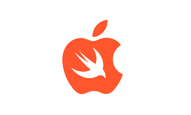

## Данила

По первому образования - экономист менеджер. Всегда нравилась работа с ПК, интересовали языки программирования. Решил начать изучение языка програмирования Swift т.к. это открытый мультипарадигмальный компилируемый язык программирования общего назначения, разработанный и поддерживаемый компанией Apple.

Ниже перечислю несколько своих навыков:
* Ответственный
* Умею работать в команде
* Пунктуальный
* Нацелен на результат

